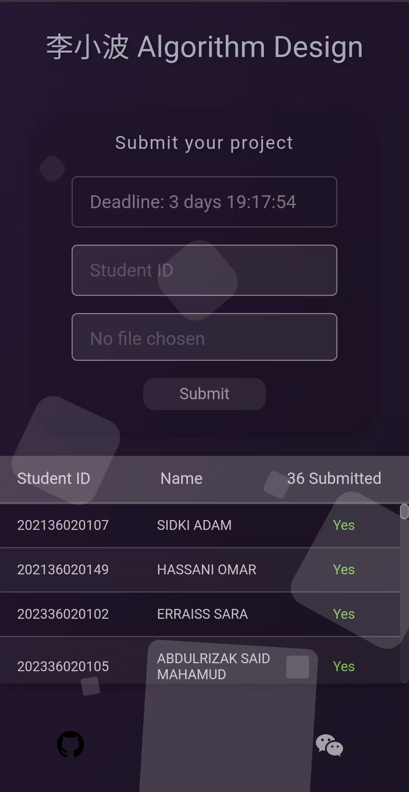
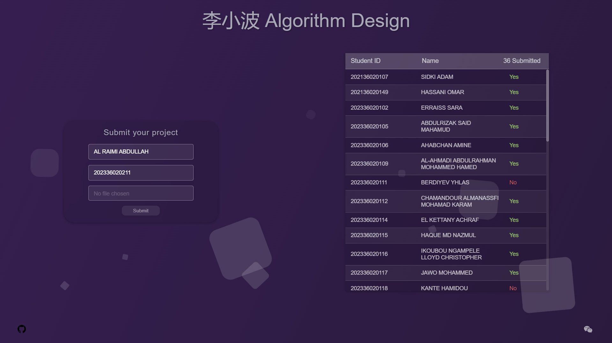

# **Submit Package**

<p align="center">
    
    
    
</p>

The **Submit** package provides a simple and customizable system for managing student submissions. Designed for Laravel applications, it offers essential tools to streamline student assignment submission processes with minimal setup.

## **Installation**

#### Step 1: Install the Package
```bash
composer require al-rimi/submit
```

#### Step 2: Run the Installation Command
```bash
php artisan submit:install
```
<details>
<summary>This command performs the following tasks:</summary>


  1. Publishes assets, views, and configuration files.
  2. Installs necessary Node.js dependencies.
  3. Updates the `vite.config.js` file with Submit assets (`submit.css` and `submit.js`).
  4. Builds assets using `npm run build`.
  5. Runs database migrations.
  6. Seeds the database with example data.

</details>

## **Features**
- **Submission Management**: Collect, validate, and store student submissions effectively.
- **Email Notifications**: Rreceive notifications after each submission.
- **Customizable Views**: Easily adjust the user interface to suit your needs.
- **Public table**: Notify users upon submission completion.

## **Customization**  

#### **Environment Variables**  
To enable submission notifications and set a deadline, add the following variables to your `.env` file:  
```env  
NOTIFICATION_EMAIL=      # Email address to receive submission notifications  
SUBMISSION_DEADLINE=     # Submission deadline in ISO 8601 format (e.g., "YYYY-MM-DDTHH:MM:SS")  
```  

#### **Routes**  
The package publishes its routes to `routes/submit.php`. You can customize these routes to:  
- Change view paths.  
- Add middleware for additional security or access control.  

#### **Views**  
All customizable views are published to your project for easy modification:  
- **Submission Page**: `resources/views/submissions.blade.php`  
- **Email Template**: `resources/views/emails/submissions_email.blade.php`  

#### **CSS and JavaScript**  
dependency-free assets for styling and interactivity in **vanilla CSS and JavaScript**:  
- **CSS File**: `resources/css/submit.css`  
- **JavaScript File**: `resources/js/submit.js`  

#### **Database**  
The package provides database migrations and a sample seeder to kickstart your setup:  
- **Migrations**: Automatically created tables for submission data.  
- **Seeder**: `database/Seeders/StudentsTableSeeder.php` populates the database with example records.  


## **Troubleshooting**

<details>
<summary><strong>Vite Configuration</strong></summary>
The package automatically adds `resources/css/submit.css` and `resources/js/submit.js` to `vite.config.js`. If this step fails, manually update your `vite.config.js` file:

    export default defineConfig({
        input: [
            'resources/css/app.css',
            'resources/js/app.js',
            'resources/css/submit.css',
            'resources/js/submit.js'
        ],
        // other Vite configuration
    });

</details>

<details>
<summary><strong>Build Issues</strong></summary>
If you encounter build issues, ensure Node.js and npm are properly installed. Then rerun:

    npm install
    npm run build
</details>

## **Uninstallation**

#### Step 1: Remove all traces of the Submit package:
```bash
php artisan submit:uninstall
```
#### Step 2: remove the package:
```bash
composer remove al-rimi/submit
```

## **Requirements**
- PHP 8.0 or higher  
- Laravel 10.x or 11.x  
- Node.js (for Vite asset compilation)  

> Have questions or facing issues? Check out the [issues page](https://github.com/Al-rimi/submit-pak/issues).  

## **License**
This package is open-source and is licensed under the [MIT License](LICENSE).  